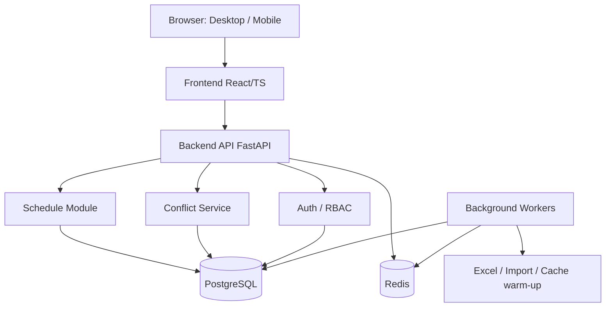
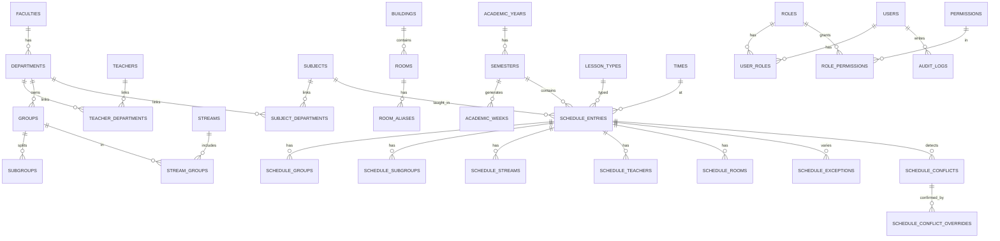

# Технічна база

**Спринт 1** · тімлід + команда розробки. Джерело: розділи 93–96, 108–109 ТЗ.

## Набори даних
- **Довідкові:** факультети, кафедри, викладачі, групи/підгрупи/потоки, дисципліни, типи занять, корпуси, аудиторії (+ aliases), час пар.
- **Календарні:** академічні роки, семестри, навчальні тижні, календарні винятки.
- **Розклад:** заняття та зв'язки (групи, підгрупи, потоки, викладачі, аудиторії), винятки, конфлікти, override.
- **Службові:** користувачі, ролі, права, audit_logs, system_settings.
- **Тестові дані:** реальний зразок розкладу від замовника (запит у follow-up) + синтетичні набори для 100+ груп і крайніх випадків розділу 101.

## Стек технологій (рекомендований, розділ 108)
| Шар | Технологія |
|---|---|
| Backend | Python, FastAPI, SQLAlchemy |
| БД | PostgreSQL |
| Кеш / черги | Redis, Celery або RQ |
| Frontend | React + TypeScript (або Vue/Angular) |
| Excel | openpyxl + BytesIO |
| Інфраструктура | Docker, Nginx |

## Архітектура (міркування)
- Модульний моноліт: Schedule Module, Conflict Service, Auth/RBAC, окремий `ExcelExportService` без залежності від HTTP.
- Права — permission-модель поверх ролей, перевірка на backend.
- Конфлікти порівнюються за (семестр + навчальний тиждень/парність + день + час + ресурс).
- Redis: ключі `schedule:{group|teacher|room|department}:{id}:{date}`, інвалідація при зміні заняття, background-прогрів.
- Фонові задачі: великий Excel, імпорт, прогрів кешу.

## Проєктування БД (35 таблиць, спрощена ER-схема)

**Усі 35 таблиць:** users, roles, permissions, user_roles, role_permissions · faculties, departments · teachers, teacher_departments · groups, subgroups, streams, stream_groups · subjects, subject_departments, lesson_types · academic_years, semesters, academic_weeks, calendar_exceptions · times · buildings, rooms, room_aliases · schedule_entries, schedule_groups, schedule_subgroups, schedule_streams, schedule_teachers, schedule_rooms · schedule_exceptions, schedule_conflicts, schedule_conflict_overrides · audit_logs · system_settings.

**Індекси:** `(semester_id, day_of_week, time_id)` та варіанти з `teacher_id`, `group_id`, `room_id` (розділ 96).
